## Час: 0:05:00 - 0:05:03
 Привіт.

## Час: 0:05:03 - 0:05:05
 Привіт.

## Час: 0:05:13 - 0:05:19
 Ходи не так много, я дошла до последньої лікції.

## Час: 0:05:19 - 0:05:21
 Не żвен яWork.

## Час: 0:05:21 - 0:05:23
 Та ми много langобу говоритьOL?

## Час: 0:05:23 - 0:05:27
 На моє partie про цеquezкують Technical Analyz doubled

## Час: 0:05:27 - 0:05:33
 Іshaped

## Час: 0:05:33 - 0:05:35
 Так danke

## Час: 0:05:35 - 0:05:39
 Якщо PCB п pierwsze тебе в investigated

## Час: 0:05:39 - 0:05:42
 То, я в hierarch larger

## Час: 0:05:43 - 0:05:45
 Ну, тxic

## Час: 0:05:45 - 0:05:48
 Полагато его не Rug.

## Час: 0:05:49 - 0:06:04
 Так, поки обговоримо, чиможе є якісь запитання, поки не почало в ексію, сьогодні буде досить така несклавна ексія,

## Час: 0:06:04 - 0:06:24
 порівня нас попередніми, так загалі ідні, тому так, але домашка буде досить чекала, але опціональна, тому що я не впевнений, наскільки там буду хисо, чоти часи на неї ось.

## Час: 0:06:25 - 0:06:31
 А за кількою випадання, а скільки ще буде додаток?

## Час: 0:06:31 - 0:06:35
 Я думаю це останні, так, це останні.

## Час: 0:06:35 - 0:06:38
 Ага, добре, по-моєм.

## Час: 0:06:39 - 0:06:45
 Чи був у нас сети Селоф в наших лексіях?

## Час: 0:06:47 - 0:06:49
 Засіщений не був.

## Час: 0:06:50 - 0:06:53
 Якщо не шибальство, не було?

## Час: 0:06:53 - 0:06:58
 Ну, ладно, розвитатися, не буду, просто лінку скинув.

## Час: 0:06:59 - 0:07:05
 Не все я встиг розказати, наприклад, ще діпіон не зтих розказати.

## Час: 0:07:05 - 0:07:09
 Ну, так, пару слов про них розказував.

## Час: 0:07:11 - 0:07:14
 Не, про сити Селоф, значе, було.

## Час: 0:07:14 - 0:07:16
 В лекціі по-морозу.

## Час: 0:07:16 - 0:07:19
 В цьому я не був, а в цьому я не був.

## Час: 0:07:19 - 0:07:22
 А якщо не шибальство, не було?

## Час: 0:07:23 - 0:07:26
 Не, про сити Селоф, значе, було.

## Час: 0:07:26 - 0:07:29
 В лекціі по-аудію.

## Час: 0:07:29 - 0:07:32
 Ну, ладно, просто, на годині.

## Час: 0:07:34 - 0:07:38
 Ну, якщо я посмотрю, так, ім'яно, там, допустим,

## Час: 0:07:38 - 0:07:41
 який був сайт, який ми розуміли, щоб,

## Час: 0:07:41 - 0:07:44
 то точно скажу, ми так, на слух,

## Час: 0:07:44 - 0:07:46
 розказати.

## Час: 0:07:46 - 0:07:48
 Окей.

## Час: 0:07:49 - 0:07:53
 Так, чи є ще, чи є запитання, ще раз запитаю.

## Час: 0:07:53 - 0:07:57
 Чи є там звук сих, чи все окей.

## Час: 0:08:00 - 0:08:03
 Добре, Байча, так, все окей.

## Час: 0:08:03 - 0:08:06
 Дякуємо. Так.

## Час: 0:08:06 - 0:08:09
 Окей, ну, будемо по-троху почнути.

## Час: 0:08:13 - 0:08:15
 Так.

## Час: 0:08:18 - 0:08:20
 Так.

## Час: 0:08:20 - 0:08:22
 Ну, я виселок нагадаю,

## Час: 0:08:22 - 0:08:24
 сити Селоф,

## Час: 0:08:24 - 0:08:27
 коли ми робимо тарискріпсі у аудіо,

## Час: 0:08:27 - 0:08:29
 і ми хочемо, там,

## Час: 0:08:29 - 0:08:31
 на сіті звук ведовшися,

## Час: 0:08:31 - 0:08:33
 ми його змачимо просто

## Час: 0:08:33 - 0:08:35
 в єдинний тітеро.

## Час: 0:08:35 - 0:08:38
 І поставляємо такі спан-якість

## Час: 0:08:38 - 0:08:40
 чарктери між

## Час: 0:08:40 - 0:08:42
 буквами, щоб, наприклад,

## Час: 0:08:42 - 0:08:45
 нас три букви Л не змачилися в одну Л.

## Час: 0:08:45 - 0:08:47
 Змачалось дві тому, що тут цей

## Час: 0:08:49 - 0:08:51
 стоїть спан-оперейтер,

## Час: 0:08:51 - 0:08:53
 яку не напам'ятаю, це правильно називається.

## Час: 0:08:53 - 0:08:55
 Ось.

## Час: 0:08:55 - 0:08:57
 Так, наче розвідалося.

## Час: 0:08:57 - 0:08:59
 Ось.

## Час: 0:08:59 - 0:09:01
 Да, так, було.

## Час: 0:09:01 - 0:09:03
 Так.

## Час: 0:09:03 - 0:09:05
 Діпіо.

## Час: 0:09:05 - 0:09:07
 Про діпіо пару слив, тут процес по хорошому

## Час: 0:09:07 - 0:09:09
 силу лекції потрібно.

## Час: 0:09:09 - 0:09:11
 Так.

## Час: 0:09:11 - 0:09:13
 Двих словах.

## Час: 0:09:13 - 0:09:15
 Замість РЛПЧФ,

## Час: 0:09:15 - 0:09:17
 якщо пам'ятаєте,

## Час: 0:09:17 - 0:09:19
 те, що ми робили для

## Час: 0:09:19 - 0:09:21
 алаймента.

## Час: 0:09:21 - 0:09:23
 Джіптіжки.

## Час: 0:09:23 - 0:09:25
 Ми можемо

## Час: 0:09:25 - 0:09:27
 не використовувати

## Час: 0:09:27 - 0:09:29
 перенфорсу в керлі,

## Час: 0:09:29 - 0:09:31
 зовсім, а

## Час: 0:09:31 - 0:09:33
 оптимізувати це напрямо.

## Час: 0:09:33 - 0:09:35
 Ось.

## Час: 0:09:35 - 0:09:37
 Так, так.

## Час: 0:09:37 - 0:09:39
 Так, так.

## Час: 0:09:39 - 0:09:41
 Ось.

## Час: 0:09:41 - 0:09:43
 Ну, в ду словах там

## Час: 0:09:43 - 0:09:45
 все сводиться до такої формули,

## Час: 0:09:45 - 0:09:47
 навіть, навіть, навіть

## Час: 0:09:47 - 0:09:49
 код попрожив зараз.

## Час: 0:10:03 - 0:10:05
 Рек, преференксферінизацій,

## Час: 0:10:05 - 0:10:07
 а тут я хоришся.

## Час: 0:10:07 - 0:10:09
 Так.

## Час: 0:10:19 - 0:10:21
 Це в пейпері було.

## Час: 0:10:21 - 0:10:23
 Десь я бачив,

## Час: 0:10:23 - 0:10:25
 непогано,

## Час: 0:10:25 - 0:10:27
 лише з РЛКОНУ.

## Час: 0:10:27 - 0:10:29
 Ага.

## Час: 0:10:29 - 0:10:31
 Так, ось.

## Час: 0:10:31 - 0:10:33
 Так, що в нас?

## Час: 0:10:33 - 0:10:35
 Ми беремо

## Час: 0:10:35 - 0:10:37
 логерів морегідностей,

## Час: 0:10:37 - 0:10:39
 токінів

## Час: 0:10:39 - 0:10:41
 Вінера

## Час: 0:10:41 - 0:10:43
 і токінів Лузера

## Час: 0:10:43 - 0:10:45
 з нашої основної модельки

## Час: 0:10:45 - 0:10:47
 і з нашої референц-модельки.

## Час: 0:10:47 - 0:10:49
 Все.

## Час: 0:10:49 - 0:10:51
 Далі.

## Час: 0:10:53 - 0:10:55
 Беремо решо.

## Час: 0:10:55 - 0:10:57
 Це, наприклад,

## Час: 0:10:57 - 0:10:59
 наскільки

## Час: 0:10:59 - 0:11:01
 у нас в морегідність

## Час: 0:11:01 - 0:11:03
 слова очевидно под,

## Час: 0:11:03 - 0:11:05
 так думаю,

## Час: 0:11:05 - 0:11:07
 точно видно.

## Час: 0:11:07 - 0:11:09
 Скільки в регіність

## Час: 0:11:09 - 0:11:11
 токінови

## Час: 0:11:11 - 0:11:13
 більш правильного

## Час: 0:11:13 - 0:11:15
 токінови Вінера,

## Час: 0:11:15 - 0:11:17
 нескільки він більше,

## Час: 0:11:17 - 0:11:19
 ніж токін Лузера.

## Час: 0:11:19 - 0:11:21
 Ось.

## Час: 0:11:21 - 0:11:23
 Або, ну так.

## Час: 0:11:23 - 0:11:25
 І другий решо.

## Час: 0:11:25 - 0:11:27
 Це та ж саме, але тепер не по-осанній нашій

## Час: 0:11:27 - 0:11:29
 поліці модельки

## Час: 0:11:29 - 0:11:31
 Пі.

## Час: 0:11:31 - 0:11:33
 По нашої,

## Час: 0:11:33 - 0:11:35
 по нашому референцію.

## Час: 0:11:35 - 0:11:37
 Це ось цей

## Час: 0:11:37 - 0:11:39
 сфт.

## Час: 0:11:39 - 0:11:41
 Тобто цяка абривітура була для

## Час: 0:11:41 - 0:11:43
 модельки,

## Час: 0:11:43 - 0:11:45
 по якою ми там реалізували

## Час: 0:11:45 - 0:11:47
 в РЛХФ.

## Час: 0:11:47 - 0:11:49
 Ось. Далі.

## Час: 0:11:53 - 0:11:55
 Беремо

## Час: 0:11:55 - 0:11:57
 нормалізумо через

## Час: 0:11:57 - 0:11:59
 сігмойду.

## Час: 0:11:59 - 0:12:01
 Наскільки в нас

## Час: 0:12:01 - 0:12:03
 відрізняється

## Час: 0:12:03 - 0:12:05
 решо

## Час: 0:12:05 - 0:12:07
 по нашій

## Час: 0:12:07 - 0:12:09
 поліці модельки,

## Час: 0:12:09 - 0:12:11
 від референс модельки.

## Час: 0:12:11 - 0:12:13
 Решо референс модельки.

## Час: 0:12:13 - 0:12:15
 Далі

## Час: 0:12:15 - 0:12:17
 якісь гипро програми Тербета

## Час: 0:12:23 - 0:12:25
 для розрахункового ревардів.

## Час: 0:12:25 - 0:12:27
 Реварди

## Час: 0:12:27 - 0:12:29
 це в нас

## Час: 0:12:31 - 0:12:33
 по-фон.

## Час: 0:12:33 - 0:12:35
 Так.

## Час: 0:12:37 - 0:12:39
 Так, а де це взяли?

## Час: 0:12:41 - 0:12:43
 Ага, це

## Час: 0:12:43 - 0:12:45
 продається на функцію.

## Час: 0:12:45 - 0:12:47
 Логарив

## Час: 0:12:47 - 0:12:49
 пробов'юті з поліції та референсом.

## Час: 0:12:49 - 0:12:51
 Ідемося скільки там

## Час: 0:12:51 - 0:12:53
 у них різних

## Час: 0:12:53 - 0:12:55
 різниць.

## Час: 0:12:55 - 0:12:57
 Ось.

## Час: 0:12:57 - 0:12:59
 В принципі це поміщається

## Час: 0:12:59 - 0:13:01
 ідея в

## Час: 0:13:01 - 0:13:03
 кількі строк.

## Час: 0:13:03 - 0:13:05
 По суді там все розвернуто,

## Час: 0:13:05 - 0:13:07
 вся математка там на

## Час: 0:13:07 - 0:13:09
 30-ти ринок пейперу.

## Час: 0:13:09 - 0:13:11
 Тому,

## Час: 0:13:11 - 0:13:13
 мабуть, зараз не це

## Час: 0:13:13 - 0:13:15
 зуштати багато уваги, не будемо. Просто її.

## Час: 0:13:15 - 0:13:17
 І це, в принципі,

## Час: 0:13:17 - 0:13:19
 працював навіть краще,

## Час: 0:13:19 - 0:13:21
 ніж РЛХФ.

## Час: 0:13:21 - 0:13:23
 Тобто там показано що на модельках,

## Час: 0:13:23 - 0:13:25
 які

## Час: 0:13:25 - 0:13:27
 менше заразмерені,

## Час: 0:13:27 - 0:13:29
 7 млн параметрів,

## Час: 0:13:29 - 0:13:31
 вони там показують кращу якийсь

## Час: 0:13:31 - 0:13:33
 ніж там, наприклад, лама

## Час: 0:13:33 - 0:13:35
 на ступну 35 млн

## Час: 0:13:35 - 0:13:37
 параметрів, не пам'ятаю.

## Час: 0:13:37 - 0:13:39
 Максимально на 70,

## Час: 0:13:39 - 0:13:41
 перцин ще якась я не пам'ятаю.

## Час: 0:13:41 - 0:13:43
 Ось.

## Час: 0:13:43 - 0:13:45
 Тому такий досі ефективний має

## Час: 0:13:45 - 0:13:47
 таке наче.

## Час: 0:13:47 - 0:13:49
 Чи є питання по діпіло?

## Час: 0:13:51 - 0:13:53
企ато видають питання.

## Час: 0:13:57 - 0:13:59
 Вогне East Temp thirty.

## Час: 0:13:59 - 0:14:01
 Нора трохocado.

## Час: 0:14:01 - 0:14:03
 Тим neon Fighter.

## Час: 0:14:03 - 0:14:04
 Я вод bomb

## Час: 0:14:04 - 0:14:07
 Ж운�в 첫elle generic stars трохно methy paused.

## Час: 0:14:16 - 0:14:18
 І як також думаєш saying,

## Час: 0:14:18 - 0:14:19
 що собирать 일이 не вumi tyt relies on

## Час: 0:14:19 - 0:14:30
 Майдорище, все ж таки. Якщо все окей, то йдемо далі.

## Час: 0:14:30 - 0:14:39
 Сьогоднішня наша тема буде по ленграв. Про ламе індекс не буде, я просто ставлю синку.

## Час: 0:14:39 - 0:14:50
 Але це досить схоже, але для ламе є якісь інші моделі. Я не пам'ятаю.

## Час: 0:14:50 - 0:14:57
 Так, tutorial.

## Час: 0:14:58 - 0:15:08
 Ланшейцін, такий фреморк, який дозволяє працювати трохи праща з ленгарами.

## Час: 0:15:08 - 0:15:12
 Може використовуватися якісь ленгар з капішки.

## Час: 0:15:12 - 0:15:23
 Наприклад, джемо з угола, чи джепті з опенею, або з клавтантрок.

## Час: 0:15:23 - 0:15:30
 Тут багато єворіантів, які модельки можна брати. Тут всьому прикладу, і ми взяли чи птичитель.

## Час: 0:15:30 - 0:15:39
 Що ми робимо? В нас є системний месець.

## Час: 0:15:39 - 0:15:44
 Цей месець задучає моделю бачать при кожніх інераціях.

## Час: 0:15:44 - 0:15:54
 В нас є історія досить велика. Вона просто остається цей системі месець один раз перед кожна генерація.

## Час: 0:15:54 - 0:16:01
 Просто щось заганено інформація для модельки, яку вона повинна запомітовувати перед генерація.

## Час: 0:16:01 - 0:16:06
 Наприклад, це даємо таку інструкцію, як проведити з індійською на ідаляскому.

## Час: 0:16:07 - 0:16:13
 Кожен месець, наприклад, ми написали хай, воно приклало одразу чао.

## Час: 0:16:13 - 0:16:19
 При цьому ми в хіміном месець, і нічого не писали, все в системі месець.

## Час: 0:16:19 - 0:16:24
 Якщо б у питанні, ви завжди не останувайте.

## Час: 0:16:24 - 0:16:27
 Як і завжди.

## Час: 0:16:27 - 0:16:29
 Далі.

## Час: 0:16:29 - 0:16:33
 Що цікаво.

## Час: 0:16:33 - 0:16:43
 Модель взяли ось з чатопи на яй.

## Час: 0:16:43 - 0:16:46
 Модель додали чіпті чотири, можна якусь іншу вибрати.

## Час: 0:16:46 - 0:16:54
 Можна вибрати якусь версістеру, березі нього, наприклад, джіпті чотири, яку перша вийшла.

## Час: 0:16:54 - 0:16:57
 Тут взяли ось останній чіпті чотири.

## Час: 0:16:57 - 0:17:02
 Зо сторова це в моделі.

## Час: 0:17:02 - 0:17:09
 В моделі є методинвок, ми передаємо ось цій список месечів.

## Час: 0:17:09 - 0:17:11
 Просто лист.

## Час: 0:17:11 - 0:17:16
 І на ось цьому списку месечів ми можемо якийсь реалізатор тримати.

## Час: 0:17:16 - 0:17:18
 Ось.

## Час: 0:17:18 - 0:17:22
 Ну так, тут так, в шинвок і в принципі теж саме.

## Час: 0:17:22 - 0:17:26
 Просто, ну так, теж саме.

## Час: 0:17:26 - 0:17:28
 Окей.

## Час: 0:17:29 - 0:17:34
 Тепер ми ще додали парсер.

## Час: 0:17:34 - 0:17:40
 Він просто буде із ось такого якогось класу,

## Час: 0:17:40 - 0:17:47
 якогось конструкції витягувати там просто нашу відпиті.

## Час: 0:17:47 - 0:17:51
 Тобто парсер-инвок на результаті яка видала моделька.

## Час: 0:17:51 - 0:17:56
 І вона просто видала СТР замість осього того класу.

## Час: 0:17:56 - 0:18:00
 З або якийсь дікшнерів.

## Час: 0:18:00 - 0:18:04
 Ну, це, скажіше, все клас.

## Час: 0:18:04 - 0:18:07
 Так.

## Час: 0:18:07 - 0:18:10
 Далі, що тут цікаво є?

## Час: 0:18:10 - 0:18:14
 Є оператор ОР, але він тут не ОР-оператор,

## Час: 0:18:14 - 0:18:20
 а він оператор пайплайну, пайплоператор.

## Час: 0:18:20 - 0:18:27
 Його просто перегрузили там.

## Час: 0:18:27 - 0:18:30
 В паттені можна вказувати, які там операції ще роблять.

## Час: 0:18:30 - 0:18:37
 Наприклад, можна, якщо в нас якесь перемножена матриця,

## Час: 0:18:37 - 0:18:41
 ми якесь там сій напапішемо, можемо перегрузити там оператор ЕД,

## Час: 0:18:41 - 0:18:44
 або перегрузити оператор ПІУС.

## Час: 0:18:44 - 0:18:48
 У нас навхід два списка числ.

## Час: 0:18:48 - 0:18:51
 І ми прегрузили оператор ПІУС,

## Час: 0:18:51 - 0:18:56
 щоб він, коли отримав нахід два списка, він їх по елементну списовував.

## Час: 0:18:56 - 0:19:05
 Тут також зробили, просто перегрузили на якусь свою функцію, цій метод.

## Час: 0:19:05 - 0:19:08
 Що він робить?

## Час: 0:19:08 - 0:19:14
 Він це просто пайплайптор, а от з попереднього ми перейдемо на наступні.

## Час: 0:19:14 - 0:19:20
 Наприклад, нас ідея модель, і потім це парсер, який достої СТР.

## Час: 0:19:23 - 0:19:25
 Тепер в нас це чейн.

## Час: 0:19:25 - 0:19:31
 Тобто, зв'язали ці елементи в один пайплай, або чейн.

## Час: 0:19:31 - 0:19:36
 А далі ми просто, щоб поочередно не запускати всі,

## Час: 0:19:36 - 0:19:40
 з початком далі потім парсера, можемо запустити один раз чейн,

## Час: 0:19:40 - 0:19:45
 і він пройдеться по всьому пайплані, з кігоб тут аргументів набило через оператору.

## Час: 0:19:51 - 0:19:53
 Чи є питання, поки...

## Час: 0:19:57 - 0:19:59
 Ок, йдемо так.

## Час: 0:19:59 - 0:20:02
 Якщо питання, то задувайте звісно.

## Час: 0:20:11 - 0:20:14
 Темплейтер.

## Час: 0:20:14 - 0:20:20
 Можемо задати, якийсь темплейт, указуємо через фігурні скобочки.

## Час: 0:20:20 - 0:20:28
 І далі ми можемо, наприклад, темплейт для асістів Промта.

## Час: 0:20:28 - 0:20:31
 Далі.

## Час: 0:20:33 - 0:20:37
 Через, покидемо через, вначинені, скидити темплейтер.

## Час: 0:20:37 - 0:20:46
 Чи от Промта, вимагаємо, що системі Промта буде продавати систему темплейту.

## Час: 0:20:46 - 0:20:48
 І...

## Час: 0:20:48 - 0:20:52
 ...а юзеру там по темплейту буде продавати текст.

## Час: 0:20:52 - 0:20:54
 Все.

## Час: 0:20:56 - 0:20:57
 Далі.

## Час: 0:20:57 - 0:21:05
 Тепер можемо зробити вогол, і продати те, що ми вказали.

## Час: 0:21:05 - 0:21:15
 Тобто це лендвич, аргумент, і його значить там, італін, перевесенає, італін.

## Час: 0:21:15 - 0:21:19
 І текст це те, що там передав фігур.

## Час: 0:21:19 - 0:21:27
 Тобто з таким темплейтером можемо придавати на різній, елементи різній, якісь...

## Час: 0:21:27 - 0:21:29
 ...м'єформація.

## Час: 0:21:36 - 0:21:38
 Так.

## Час: 0:21:39 - 0:21:43
 Можемо тепер повізати темплейтер у наш чин.

## Час: 0:21:43 - 0:21:51
 Просто я дебавив напочаток, зробила темплейт, передав теперь новий Промт.

## Час: 0:21:51 - 0:21:55
 Сістем Промт і юзер-месічна модель.

## Час: 0:21:55 - 0:21:58
 І все, і тварсер тут, і все тако.

## Час: 0:22:00 - 0:22:02
 Так.

## Час: 0:22:03 - 0:22:09
 Цей сервер тут через Fast-Tap, ну це розвідати зараз не будемо, просто є така опція,

## Час: 0:22:09 - 0:22:18
 зробити ось це в якомусь вигляді, як сервер, а ось, в принципі це все просто,

## Час: 0:22:18 - 0:22:23
 по-щадковому якимось медленам.

## Час: 0:22:23 - 0:22:26
 Чи є питання по цій частині?

## Час: 0:22:29 - 0:22:31
 Вроде бы не.

## Час: 0:22:33 - 0:22:35
 Ок.

## Час: 0:22:39 - 0:22:41
 Так.

## Час: 0:22:41 - 0:22:44
 Приклад, якесь простенький чотбот.

## Час: 0:22:49 - 0:22:51
 Так.

## Час: 0:22:52 - 0:22:56
 Порадидаємо моделі, якісь месі, що є там, Привіті Поп.

## Час: 0:22:56 - 0:23:01
 Порадидаємо наступне, як ми назвати, вона нас каже, тому що у нас в такому варіанті,

## Час: 0:23:01 - 0:23:03
 немає ніякої пам'яті.

## Час: 0:23:06 - 0:23:11
 Як можна зробити пам'ять, пам'ять можна просто сохраняти якісь меседжі,

## Час: 0:23:11 - 0:23:17
 собі в лист, додавати їх, те що написали, один оте що я написала,

## Час: 0:23:17 - 0:23:25
 Оленка, що відповіла, і просто це як в історію списка на додавати.

## Час: 0:23:25 - 0:23:28
 Ось це такий самий простий варіант.

## Час: 0:23:28 - 0:23:30
 Далі.

## Час: 0:23:31 - 0:23:33
 Так.

## Час: 0:23:33 - 0:23:35
 Можна ще робити по-іншому.

## Час: 0:23:37 - 0:23:39
 Ні, секунди.

## Час: 0:23:49 - 0:23:51
 Ага.

## Час: 0:23:55 - 0:23:59
 Можна зробити по-іншому, можна зробити напряму,

## Час: 0:23:59 - 0:24:01
 передати якісь інвитивкаторсесії.

## Час: 0:24:01 - 0:24:07
 Просто занервати, наприклад, якась янікальний едішник і передатися як конфіг.

## Час: 0:24:07 - 0:24:15
 І тепер він також буде запам'ятовувати все ще, що написала Датьова в цій сесії.

## Час: 0:24:15 - 0:24:19
 Ось він також відпидає, що своїм я був.

## Час: 0:24:19 - 0:24:23
 Як така альтернатива більш-більш реально.

## Час: 0:24:23 - 0:24:27
 Передали в конфіг назву іншої сесії.

## Час: 0:24:27 - 0:24:35
 І тепер він не може назвати ім'я, тому що у нього в сесії інформаційне було.

## Час: 0:24:35 - 0:24:37
 Пифігсовий едішник на той, що був.

## Час: 0:24:37 - 0:24:41
 І він знову ж таки, може, відпусти, яке була ім'я.

## Час: 0:24:41 - 0:24:43
 Так.

## Час: 0:24:53 - 0:25:09
 Так, я запам'ятала сесію.

## Час: 0:25:09 - 0:25:19
 Ім'я, яка була ім'я.

## Час: 0:25:19 - 0:25:25
 І я також відпочивався ще знову, якесь іншій системпромт.

## Час: 0:25:25 - 0:25:31
 І так, ще один системпромт.

## Час: 0:25:31 - 0:25:43
 Якийсь ім'я, який отримує там якийсь месер, ще якийсь ленгвич, на який треба перевести.

## Час: 0:25:43 - 0:25:47
 Просто вонвок, можемо прийматися зі аргументи.

## Час: 0:25:47 - 0:25:51
 Просто піш, удобно, так комфортно.

## Час: 0:25:51 - 0:25:55
 Так.

## Час: 0:25:55 - 0:26:02
 Можемо робити, це руками мене жити цю історію.

## Час: 0:26:02 - 0:26:07
 Наприклад.

## Час: 0:26:07 - 0:26:13
 Але є проблеми, тобто якщо ми будемо багато писав до того, у нас розрозтеться ця історія.

## Час: 0:26:13 - 0:26:21
 І нам треба якось танкетити, там, наприклад, якось кількість останніх лише месерів, щоб у нас там контекст не заповнювався.

## Час: 0:26:21 - 0:26:26
 І на вишову зарану контексту можливості подаємо.

## Час: 0:26:26 - 0:26:44
 Так.

## Час: 0:26:45 - 0:26:49
 Так, ці ленгвичі, правда, здається.

## Час: 0:26:49 - 0:26:51
 Так.

## Час: 0:26:51 - 0:27:00
 Так, це не те.

## Час: 0:27:00 - 0:27:04
 Ми вдали тримір.

## Час: 0:27:04 - 0:27:12
 Достаємо злінчень на три месері, сказимо максимально кількість токенів, яку він буде запомітовати.

## Час: 0:27:12 - 0:27:20
 Тобто, останні меси, і там, якісь інклюстісти, трою і так далі.

## Час: 0:27:20 - 0:27:33
 І щоб починати нашу історію, тобто як нам танкетити, щоб там перше було в історію месерів відхіднина, або ерлентів.

## Час: 0:27:33 - 0:27:38
 А ось.

## Час: 0:27:38 - 0:27:45
 Ось просто тепер в нас починається не з...

## Час: 0:27:45 - 0:27:49
 Ну це сісти месечі, вони завжди були завшатися.

## Час: 0:27:49 - 0:27:57
 Там перше месище привідь ебоб, а тут перше месище, це що таке, скільки буде два признав?

## Час: 0:27:57 - 0:28:02
 Тобто, в'єдну за танкетово пішторі месище.

## Час: 0:28:03 - 0:28:09
 Тому коли ми це за інвокрема, він не називаєм я, тому що це було давно.

## Час: 0:28:09 - 0:28:13
 Це зарамки нашого, скажімо так, контекста.

## Час: 0:28:13 - 0:28:16
 Все.

## Час: 0:28:16 - 0:28:18
 Так.

## Час: 0:28:18 - 0:28:20
 Ну стрімінг.

## Час: 0:28:20 - 0:28:27
 Якщо хтось працював через жепті, вона генерує усі відповідь резон.

## Час: 0:28:27 - 0:28:35
 Вона її генерує пе-токину, там якось високі там відправляє по кожному токину, яка вона там генерувала.

## Час: 0:28:35 - 0:28:38
 Тут також можна це зробити.

## Час: 0:28:42 - 0:28:47
 Давайте, вибачаюсь, ніно злаза мовить.

## Час: 0:28:47 - 0:28:52
 А от так не будь-будь буде краще видно.

## Час: 0:28:52 - 0:28:54
 Так.

## Час: 0:28:58 - 0:29:01
 Пуфум.

## Час: 0:29:04 - 0:29:11
 Проходимося кожен чанк по-апстрімум.

## Час: 0:29:11 - 0:29:18
 Пуфум, придаємо темплити, конф'ях, стрімот і так далі.

## Час: 0:29:18 - 0:29:26
 Якщо чанк у нас відповідно відноситься до те, що сперва сама елемка,

## Час: 0:29:26 - 0:29:34
 то ми його, наприклад, приймтемо і в кінці якось чорточко додали, щоб просто знати,

## Час: 0:29:34 - 0:29:38
 скільки вона генерує, тобто відповідає.

## Час: 0:29:38 - 0:29:44
 Тут замість кримптум можна якось пуш зробити на випсокі, якщо у нас є кілька сервер.

## Час: 0:29:44 - 0:29:48
 Ось така оцфункція.

## Час: 0:29:57 - 0:30:00
 Віктор не базит на них.

## Час: 0:30:07 - 0:30:13
 Робув нашу базит на них, а в даному випадку це просто...

## Час: 0:30:13 - 0:30:23
 Ну, поки що це ще не вектор DB, це просто список документів, в ніченні є свій клас документів.

## Час: 0:30:24 - 0:30:29
 Що він створить, він пить контент і якась методати.

## Час: 0:30:29 - 0:30:36
 Методати зараз нам не так вважило, нам вважило це саме контент цього документу.

## Час: 0:30:36 - 0:30:41
 Ну, із такі декілька документів, в реальний практик, наприклад,

## Час: 0:30:41 - 0:30:49
 можемо розбувати якусь велику педефау на якісь досить великі чанки.

## Час: 0:30:49 - 0:30:57
 І просто, поскільки це, наприклад, по стотокинів на кожен документ,

## Час: 0:30:57 - 0:31:05
 і ось так по стотокинів ми проходимось і зробили такий список документів по нашому великому файлу,

## Час: 0:31:05 - 0:31:09
 або по декільком файлан.

## Час: 0:31:09 - 0:31:11
 Ось так.

## Час: 0:31:11 - 0:31:16
 В якості вікторно-базданих ми тут взяли хрому.

## Час: 0:31:16 - 0:31:20
 Це просто вікторно-базданих, як наприклад.

## Час: 0:31:20 - 0:31:23
 Так, фейс.

## Час: 0:31:23 - 0:31:29
 Просто трохи біжте щасно, можливо.

## Час: 0:31:29 - 0:31:34
 Важило трохи простіше.

## Час: 0:31:34 - 0:31:37
 Так.

## Час: 0:31:37 - 0:31:40
 І ми продали і єсь.

## Час: 0:31:40 - 0:31:43
 Список документів.

## Час: 0:31:47 - 0:31:50
 Список документів.

## Час: 0:31:50 - 0:31:54
 Ми отворили нашу баздану, до якої ми будемо звертатися.

## Час: 0:31:54 - 0:32:00
 Також вказуємо, що у нас буде робити embedning для цих документів.

## Час: 0:32:00 - 0:32:06
 А, ну, з'яснювати, що у нас віктор на базданих і для кожного документа у нас буде якийсь віктор.

## Час: 0:32:06 - 0:32:10
 Дану випадку, якщо ми опиємо embednings.

## Час: 0:32:16 - 0:32:23
 Він покрема є в них моделька для цього.

## Час: 0:32:23 - 0:32:30
 Наприклад, це є тексті embedning 3.

## Час: 0:32:30 - 0:32:33
 Small or large.

## Час: 0:32:33 - 0:32:38
 Але в них, звісно, різні прайсінги.

## Час: 0:32:38 - 0:32:47
 Але всі в цьому інші показники досить близькі.

## Час: 0:32:47 - 0:32:56
 Ось все ми вкарсовуємо, як для отримання embedning.

## Час: 0:32:56 - 0:32:59
 Знаво, що має стема змінювалась.

## Час: 0:32:59 - 0:33:02
 Ну, ладно.

## Час: 0:33:02 - 0:33:05
 Все, отримало нашу вактору на базданах.

## Час: 0:33:06 - 0:33:10
 Далі, тепер по цій баздані ми можемо робити сіміляртисьор.

## Час: 0:33:10 - 0:33:18
 Порадуємо акверію, наприклад, CAT, і воно там знаходити найбільш схожі документи до цього акверію.

## Час: 0:33:18 - 0:33:21
 Ось.

## Час: 0:33:25 - 0:33:32
 Так, перш само, але тепер у нас асінхронний запрос, якщо там нам потрібно це робити параллельно.

## Час: 0:33:33 - 0:33:38
 Замість сіміляртисьор, а сіміляртисьор, тобто сінхронний.

## Час: 0:33:38 - 0:33:50
 І також вийти, щоб нам отримати результат, коли в кінці треба почекати, коли в нас зажаю прийде результат.

## Час: 0:33:50 - 0:33:53
 Ну, таке просто технічний пункт.

## Час: 0:33:53 - 0:33:59
 Сіміляртисьор, що і скоро, теж само, але тепер у нас, чи сіміляртисьор, вудається.

## Час: 0:33:59 - 0:34:06
 Але і він тут щось не... Чим більше, тим краще, здається, на факіт, чим більше донв'я, тим краще.

## Час: 0:34:06 - 0:34:10
 Ну, чомусь так зробили. Але я можу помілятися.

## Час: 0:34:11 - 0:34:13
 Ось.

## Час: 0:34:19 - 0:34:22
 Можемо шукати по...

## Час: 0:34:23 - 0:34:26
 По СТР, який ми сюди передаємо.

## Час: 0:34:26 - 0:34:36
 Тому що ми вказали при сворені цього векторна баз-заних, який Ємбедінк кресовується.

## Час: 0:34:36 - 0:34:48
 І цей тесь самий опу на Ємбедінк спитягується і робить на передовому СТР-у його вектор.

## Час: 0:34:48 - 0:34:55
 Тобто під капотом. Але можемо придавати Ємбедінк напряму, якщо є така потребність.

## Час: 0:34:57 - 0:34:59
 Так.

## Час: 0:35:04 - 0:35:07
 Рано був Лямда.

## Час: 0:35:07 - 0:35:13
 Це просто здається в пайплайн.

## Час: 0:35:13 - 0:35:18
 І на попередньому інпуті вона раноть якусь функція.

## Час: 0:35:18 - 0:35:23
 В дану випадку це 7 млрд сьорж, 100 по 1 результатом.

## Час: 0:35:23 - 0:35:25
 Ось.

## Час: 0:35:27 - 0:35:30
 Ось такий тут бачий можна зробити.

## Час: 0:35:30 - 0:35:32
 1-е слово «к» – 2-е шарк.

## Час: 0:35:32 - 0:35:38
 І по одному на 1-е слово, на 2-е, вона щось там якісь документи знайшла.

## Час: 0:35:44 - 0:35:47
 Якісь хипрапераметри, не так вижливо.

## Час: 0:35:49 - 0:35:53
 Так. Тепер все збираємо разом.

## Час: 0:35:54 - 0:35:57
 Беремо якісь там 5,4, навжливо що.

## Час: 0:35:58 - 0:36:05
 Тимплейтер в нас буде працювати таким чином.

## Час: 0:36:05 - 0:36:09
 Це в нас здається «пешенансовринг».

## Час: 0:36:09 - 0:36:11
 Ну, окей, не суть.

## Час: 0:36:11 - 0:36:14
 Я «пешенансовринг». Ну так.

## Час: 0:36:14 - 0:36:17
 З «ритривел» – «аугментець».

## Час: 0:36:17 - 0:36:19
 Просто з рагом.

## Час: 0:36:19 - 0:36:20
 З «ритривером».

## Час: 0:36:20 - 0:36:22
 Що буде робитись?

## Час: 0:36:25 - 0:36:30
 Пешен, ми будемо передавати якийсь текст, який передав юзер.

## Час: 0:36:30 - 0:36:39
 В контекст ми будемо підтягувати те, що ми взяли по 7 лярх ісерчу з вектору дитабейсу.

## Час: 0:36:39 - 0:36:41
 Тимплейтер.

## Час: 0:36:43 - 0:36:46
 «хіманмайсаж». Так.

## Час: 0:36:50 - 0:37:01
 В контекст ми будемо брати з «ритривера» з оці штуки «ритривер в'єктерсторс-ритривер».

## Час: 0:37:01 - 0:37:06
 Або це теж саме ми отримали «ритривер» з рано-болгнам.

## Час: 0:37:06 - 0:37:08
 Можна так, можна так.

## Час: 0:37:08 - 0:37:13
 Тобто отримали якийсь «ритривер» на вхід, який подається якийсь там «квери».

## Час: 0:37:13 - 0:37:18
 І на вихід він буде видавати топ один результат по найближчому документу з басцених.

## Час: 0:37:21 - 0:37:23
 Так.

## Час: 0:37:25 - 0:37:28
 В контекст ми будемо заповнити з цим «ритривером».

## Час: 0:37:28 - 0:37:33
 «Квешан» просто буде передаватись те, що було на вході.

## Час: 0:37:33 - 0:37:40
 Рано був пасру, він нічого не робить, він просто передає те, що було до цього на наступний етап.

## Час: 0:37:40 - 0:37:42
 Ось.

## Час: 0:37:43 - 0:37:48
 Передаємо контекст «Квешан» на «Промт».

## Час: 0:37:48 - 0:37:51
 Воно по «Темплейтеру» його буде заповнювати.

## Час: 0:37:51 - 0:37:54
 І цей «Промт» – «Темплейтер».

## Час: 0:37:54 - 0:37:58
 Ми передаємо вже на нашу модель «Коваланку».

## Час: 0:37:59 - 0:38:01
 Так.

## Час: 0:38:03 - 0:38:05
 Це, в принципі, все.

## Час: 0:38:05 - 0:38:10
 Заробило це через «Пайпратор», отримали «Чейн».

## Час: 0:38:10 - 0:38:13
 Тепер у «Счейн» можемо однємремо записити.

## Час: 0:38:13 - 0:38:15
 Передаємо лише «Квері» «Квешан».

## Час: 0:38:15 - 0:38:17
 «Телмі обаадкетс».

## Час: 0:38:18 - 0:38:23
 Він продається на «Ритривер» там знаходиться якийсь документ про котів,

## Час: 0:38:23 - 0:38:25
 в якому ми бачили.

## Час: 0:38:25 - 0:38:28
 Заповнюються «Потемплейтеру» ось тут, ось цей документ.

## Час: 0:38:30 - 0:38:34
 А сюди ось про «Телмі обаадкетс».

## Час: 0:38:34 - 0:38:35
 Якийсь «Квешан».

## Час: 0:38:35 - 0:38:38
 Ну так, це скоріші, якийсь «Стенд» на величний.

## Час: 0:38:39 - 0:38:42
 І він просто повторює те, що йому пити, ну аз контексте.

## Час: 0:38:43 - 0:38:48
 Тобто тут, в принципі, це те ж само, що було в документі.

## Час: 0:38:50 - 0:38:52
 Просто півторило те, що в нього опід контексте.

## Час: 0:38:53 - 0:38:55
 Чи є питання?

## Час: 0:38:57 - 0:39:03
 А зараз трохи погано видно, тому що відсвідчує літери.

## Час: 0:39:03 - 0:39:05
 Кот-кот-відчує.

## Час: 0:39:06 - 0:39:09
 Тобто біло може заробити?

## Час: 0:39:11 - 0:39:14
 Так, або біло, або так, біло і краще.

## Час: 0:39:17 - 0:39:22
 Або увелищити розмір.

## Час: 0:39:25 - 0:39:26
 Біло і краще.

## Час: 0:39:26 - 0:39:28
 Дякую.

## Час: 0:39:35 - 0:39:37
 Дякую.

## Час: 0:39:37 - 0:39:39
 Дякую.

## Час: 0:40:01 - 0:40:03
 Ну, до сьогодні, на визнащення.

## Час: 0:40:03 - 0:40:05
 Так, на якому момент я проплак.

## Час: 0:40:08 - 0:40:11
 Зараз экран нерешарений.

## Час: 0:40:13 - 0:40:15
 Чи так краще?

## Час: 0:40:16 - 0:40:18
 Так, так, так, краще.

## Час: 0:40:19 - 0:40:21
 Так, чи притись заново по коду?

## Час: 0:40:23 - 0:40:25
 Може, на все було видно?

## Час: 0:40:26 - 0:40:30
 Ні, ні, було видно, але так, ну, дуже...

## Час: 0:40:30 - 0:40:31
 Я зрозумів.

## Час: 0:40:31 - 0:40:32
 Хардов.

## Час: 0:40:32 - 0:40:33
 Хардов.

## Час: 0:40:35 - 0:40:37
 Зараз краще.

## Час: 0:40:37 - 0:40:38
 Окей.

## Час: 0:40:39 - 0:40:40
 Окей, хорошо.

## Час: 0:40:41 - 0:40:42
 Дякую.

## Час: 0:40:44 - 0:40:48
 Так, чи є питання по рагу?

## Час: 0:40:48 - 0:40:52
 Тобто це є, те що ми подивилися, це є в принципі рах.

## Час: 0:40:52 - 0:40:54
 Тобто, ритрівал в менті дженерейшу.

## Час: 0:40:56 - 0:41:00
 Все, ми просто щось дотяговуємо в наш промпт.

## Час: 0:41:00 - 0:41:03
 Щось з баз даних, по якомусь там...

## Час: 0:41:04 - 0:41:06
 Сімміляри ті векторів.

## Час: 0:41:06 - 0:41:08
 В принципі це є рах.

## Час: 0:41:08 - 0:41:09
 Ось.

## Час: 0:41:13 - 0:41:16
 Чи, чи я питання, чи рухаємо, знаю.

## Час: 0:41:19 - 0:41:22
 Інформації багато, але в принципі нічого складного.

## Час: 0:41:25 - 0:41:28
 Особливо приймемо з останньими лекціями.

## Час: 0:41:29 - 0:41:31
 Ну, у мене немає питань.

## Час: 0:41:31 - 0:41:32
 Окей.

## Час: 0:41:33 - 0:41:35
 Так, ну, тоді йдемо далі про титуріал.

## Час: 0:41:35 - 0:41:39
 Це були... Це був рах, або векторів.

## Час: 0:41:39 - 0:41:42
 Тепер перейдемо до агентів.

## Час: 0:41:45 - 0:41:48
 Так, що це? Ладно.

## Час: 0:41:49 - 0:41:50
 Так.

## Час: 0:41:51 - 0:41:52
 Таріде.

## Час: 0:41:52 - 0:41:56
 Таріде це в нас пошикова...

## Час: 0:41:57 - 0:42:00
 Пошикова система для эллолемок.

## Час: 0:42:00 - 0:42:01
 Просто там більш...

## Час: 0:42:01 - 0:42:04
 Подобна опічка, коли роботися.

## Час: 0:42:04 - 0:42:07
 Ось це просто якийсь там пошиковато.

## Час: 0:42:07 - 0:42:08
 Який ми сайтам.

## Час: 0:42:10 - 0:42:11
 А так.

## Час: 0:42:15 - 0:42:18
 І зараз ми будемо...

## Час: 0:42:18 - 0:42:20
 Виколкати це якийсь функцій.

## Час: 0:42:20 - 0:42:22
 Тобто це є агенти.

## Час: 0:42:24 - 0:42:27
 Зараз, подивимо, що це деталі.

## Час: 0:42:28 - 0:42:30
 Так, поки нічого такого.

## Час: 0:42:32 - 0:42:33
 Бань туз.

## Час: 0:42:34 - 0:42:36
 А туз ми задали десь...

## Час: 0:42:37 - 0:42:38
 Ага.

## Час: 0:42:41 - 0:42:44
 Просто імпортуємо цей тевілісер.

## Час: 0:42:44 - 0:42:46
 Це може бути якийсь кастер.

## Час: 0:42:46 - 0:42:48
 Це може бути щось зленчейну.

## Час: 0:42:48 - 0:42:49
 Наприклад, кастер.

## Час: 0:42:49 - 0:42:52
 Можемо зробити якийсь калькулятор.

## Час: 0:42:52 - 0:42:55
 Просто функція калькулятора і все.

## Час: 0:42:57 - 0:43:00
 Може там запускати якийсь код.

## Час: 0:43:00 - 0:43:02
 Якісь інші функції.

## Час: 0:43:02 - 0:43:04
 Тобто агенти.

## Час: 0:43:04 - 0:43:11
 Це просто ми просимо нашу елленку запускати якусь функцій.

## Час: 0:43:11 - 0:43:13
 Тобто вона напряму запускає.

## Час: 0:43:13 - 0:43:15
 Вона там видає якийсь кастер.

## Час: 0:43:15 - 0:43:18
 Вона там видає якийсь називу функції.

## Час: 0:43:18 - 0:43:20
 Ми це парсимо.

## Час: 0:43:20 - 0:43:23
 Просто наприклад, full text-ам якимось.

## Час: 0:43:23 - 0:43:28
 І якщо ми знаходимо цей якийсь унікальний токін.

## Час: 0:43:28 - 0:43:31
 Ну, унікальний токін, унікальний кодовий слов.

## Час: 0:43:31 - 0:43:33
 Для запуску функції ми запусками функції.

## Час: 0:43:33 - 0:43:36
 І якись є ароменти також і передаємо.

## Час: 0:43:40 - 0:43:41
 Ну, і такий приклад.

## Час: 0:43:41 - 0:43:43
 Search and walk.

## Час: 0:43:43 - 0:43:47
 Тобто це, як їм всі інше, можна інвокати.

## Час: 0:43:47 - 0:43:50
 І якийсь результат отримати.

## Час: 0:43:50 - 0:43:53
 Ну, ось тут якийсь результати видає.

## Час: 0:43:53 - 0:43:54
 Якісь сайти.

## Час: 0:43:54 - 0:43:56
 Якийсь контент сайтов.

## Час: 0:43:56 - 0:44:02
 Тобто воно і трохи сайти підважає разом з якою інформацією.

## Час: 0:44:02 - 0:44:06
 Ось це є наш бутись search-модер.

## Час: 0:44:06 - 0:44:08
 Яким будемо ваклакати.

## Час: 0:44:08 - 0:44:10
 Сохранили список тулів.

## Час: 0:44:11 - 0:44:14
 Тут список із нових елементів просто search.

## Час: 0:44:14 - 0:44:17
 А тут може бути більше елементів.

## Час: 0:44:40 - 0:44:42
 Щось я зновусь.

## Час: 0:44:42 - 0:44:44
 Так.

## Час: 0:44:47 - 0:44:49
 А, придали.

## Час: 0:44:49 - 0:44:54
 Придаємо в модель, щоб вона збандилась нашими тулзами.

## Час: 0:44:54 - 0:44:56
 Все.

## Час: 0:44:56 - 0:45:01
 Тепер у нас буде модель, яка може випекати, якийсь тулз.

## Час: 0:45:01 - 0:45:03
 Так, тут просто.

## Час: 0:45:03 - 0:45:05
 Під капотом робиться.

## Час: 0:45:05 - 0:45:09
 Там далі буде подробно, як це можна щось кастомно робити.

## Час: 0:45:11 - 0:45:13
 Так.

## Час: 0:45:15 - 0:45:17
 Сказали їх, хай.

## Час: 0:45:17 - 0:45:19
 Відповів, хлоп.

## Час: 0:45:19 - 0:45:22
 Спросили, яка погода там в Санфранциску.

## Час: 0:45:22 - 0:45:26
 І він там по викликав цю тузу збіжку.

## Час: 0:45:26 - 0:45:28
 І вона випекала, що якийсь тулз.

## Час: 0:45:28 - 0:45:30
 Яка погода там в Санфранциску.

## Час: 0:45:30 - 0:45:34
 І він там по викликав цю тузу пошуку.

## Час: 0:45:34 - 0:45:40
 І знайшов там якийсь інформацію, яку він там видав.

## Час: 0:45:45 - 0:45:51
 Ага, це поки просто контент з рині, нічого ще не видав.

## Час: 0:45:52 - 0:46:00
 І сохранили в внутрі цього класу, в Тауколс, що ми визвали якийсь тулз.

## Час: 0:46:00 - 0:46:02
 Просто наша історія.

## Час: 0:46:02 - 0:46:04
 Так.

## Час: 0:46:12 - 0:46:14
 Так.

## Час: 0:46:17 - 0:46:19
 Так.

## Час: 0:46:19 - 0:46:21
 Хай, халло.

## Час: 0:46:21 - 0:46:23
 Яка погода.

## Час: 0:46:23 - 0:46:26
 Він там вдає вже емеси.

## Час: 0:46:26 - 0:46:30
 На основі того, що видав наш пошук.

## Час: 0:46:30 - 0:46:35
 На основі цього винруйся, якась там відпитати.

## Час: 0:46:35 - 0:46:39
 Бо я санфранцис жалтий і так далі.

## Час: 0:46:39 - 0:46:41
 Так.

## Час: 0:46:42 - 0:46:44
 І він тут.

## Час: 0:46:44 - 0:46:46
 Ага, це все, можуть.

## Час: 0:46:46 - 0:46:50
 Окей, про агенти, я думаю, ще подивимось більш титально.

## Час: 0:46:53 - 0:46:57
 Тодавання мемори це, співдень також.

## Час: 0:46:57 - 0:46:59
 Зараз.

## Час: 0:46:59 - 0:47:01
 Так.

## Час: 0:47:02 - 0:47:04
 Так.

## Час: 0:47:07 - 0:47:10
 Де я бачив, що агентів.

## Час: 0:47:15 - 0:47:17
 Ну, а на, може, ще повернемось.

## Час: 0:47:20 - 0:47:25
 Початкувати, що подивимось, як на розв'язканому рак.

## Час: 0:47:25 - 0:47:27
 Так.

## Час: 0:47:31 - 0:47:44
 Ага, Парсимо, якийсь страницю, щоб зробити ретривер нашого векторів вас зданих.

## Час: 0:47:44 - 0:47:47
 Так, з Парсили.

## Час: 0:47:47 - 0:47:49
 Так.

## Час: 0:47:49 - 0:47:51
 Парсимо, Парсимо, системпромт.

## Час: 0:47:51 - 0:47:53
 Зробили якийсь системпромт.

## Час: 0:47:53 - 0:47:56
 Там задали якісь інструкції.

## Час: 0:47:56 - 0:48:00
 І системпромт тим також ми там, плядь, задали.

## Час: 0:48:01 - 0:48:03
 Так.

## Час: 0:48:09 - 0:48:16
 Тобто до інпата людини, можемо також щось здавати, якщо є жані, то просто напрямо продається.

## Час: 0:48:31 - 0:48:33
 І страниць ретривер.

## Час: 0:48:33 - 0:48:35
 Розстал йдемо пам'ять.

## Час: 0:48:41 - 0:48:47
 Ну, а на це, може, нічого таку кардинальну, але воно буде.

## Час: 0:48:47 - 0:48:52
 Та, що ж, якийсь ретривер, якийсь ретривер, якийсь ретривер.

## Час: 0:48:52 - 0:48:54
 Так.

## Час: 0:48:56 - 0:49:02
 Ну, а на це, може, нічого таку кардинальну, але воно буде.

## Час: 0:49:08 - 0:49:10
 Ладно.

## Час: 0:49:12 - 0:49:14
 Лафе.

## Час: 0:49:14 - 0:49:16
 Ну, ладно.

## Час: 0:49:18 - 0:49:20
 Ладно, це, на це, нічого воно буде.

## Час: 0:49:21 - 0:49:27
 Так. Чи є питання по цій частині, по векторіумам, базомданам, по агентам?

## Час: 0:49:36 - 0:49:38
 Тоді перейдемо до іншої тозиції.

## Час: 0:49:38 - 0:49:44
 Це такий роззиток лунчайного лунграв, від тих же самих авторів.

## Час: 0:49:45 - 0:49:50
 І тут є дещо нові зміна.

## Час: 0:49:55 - 0:50:01
 Я нагадую, що в нас був ранний пасру, тобто він передає теж саме, що й було на вході.

## Час: 0:50:01 - 0:50:12
 В нас був ранний билганде, тобто те, що з попереднього разу передали, ми притворюємо через якусь функцій, наприклад, через ретривер, ми щось там дістаємо.

## Час: 0:50:12 - 0:50:16
 І також є, ми не розв'язали, а раніше був паралел.

## Час: 0:50:16 - 0:50:19
 Тобто якісь таски ми робимо в паралелі.

## Час: 0:50:19 - 0:50:26
 Там, наприклад, одна таска загуглала, інша там подивилась якось в вас в даних кодах.

## Час: 0:50:26 - 0:50:31
 Тобто ось так можна їх розділяти.

## Час: 0:50:31 - 0:50:36
 Ланчен ще більш адванстоїдея.

## Час: 0:50:36 - 0:50:45
 Давайте там не просто паралелити, а зробимо ось такий якийсь грав.

## Час: 0:50:45 - 0:50:53
 Або якийсь більш грав, де ми можемо з одного стану вчитатися діймішого.

## Час: 0:50:53 - 0:50:58
 Ну, зараз розділянемо я, що тут можна робити.

## Час: 0:50:58 - 0:51:03
 Перше, задаємо якийсь стейт, якийсь будемо старити миседжі.

## Час: 0:51:03 - 0:51:07
 І робимо стейт грав, повер стейт.

## Час: 0:51:07 - 0:51:10
 Ось.

## Час: 0:51:14 - 0:51:18
 Додаємо ноду.

## Час: 0:51:18 - 0:51:21
 Нода, це в нас буде якась функція.

## Час: 0:51:22 - 0:51:32
 А рибра, це якісь приходи від одного, від першої функції до іншої, до другої.

## Час: 0:51:32 - 0:51:40
 Додали першу узел, все в нас чотбот.

## Час: 0:51:40 - 0:51:48
 Це просто буде лемка, який будемо передавати там якийсь миседж зі стейтом.

## Час: 0:51:49 - 0:51:51
 Поточний.

## Час: 0:51:51 - 0:51:55
 Так, додаємо рибра.

## Час: 0:51:55 - 0:51:59
 По-перше, нам зі старту потрібно прийти в чотбот.

## Час: 0:51:59 - 0:52:03
 І, по-друге, там чотботу прийти завершити роботу.

## Час: 0:52:03 - 0:52:05
 А в лент.

## Час: 0:52:05 - 0:52:08
 А все, робимо грав-білдер-компайл.

## Час: 0:52:08 - 0:52:15
 Можемо задісплеюти це через дисплей вакуатимський.

## Час: 0:52:16 - 0:52:23
 Вирігатися ось наша проста моделька, вона поки що нічого такого не робить, щоб там було влінчення.

## Час: 0:52:23 - 0:52:26
 Просто старт, чотбот, рент.

## Час: 0:52:26 - 0:52:28
 Все, це є на жираф.

## Час: 0:52:28 - 0:52:30
 Так.

## Час: 0:52:34 - 0:52:36
 І тепер...

## Час: 0:52:39 - 0:52:41
 Ок, ладно.

## Час: 0:52:42 - 0:52:47
 Так, тепер можемо додати якийсь тулз зайдеться в графу.

## Час: 0:52:47 - 0:52:51
 Підрузили наш тавіде сюрдж-резалт.

## Час: 0:52:51 - 0:52:54
 Tools, Tool & Walk.

## Час: 0:52:54 - 0:52:58
 Ну, це просто для демонстрації, що пошук при цьому.

## Час: 0:52:58 - 0:53:00
 Далі.

## Час: 0:53:07 - 0:53:10
 State, меседжі просто, сеги, граф, State.

## Час: 0:53:11 - 0:53:14
 L-Lank, якийсь підрозили сантропіку.

## Час: 0:53:14 - 0:53:16
 Kla 3.5 net.

## Час: 0:53:16 - 0:53:20
 Довідь, непогадна моделька, до речі.

## Час: 0:53:23 - 0:53:25
 Так, далі.

## Час: 0:53:28 - 0:53:32
 Забайдили наші тулзи до L-Lank.

## Час: 0:53:32 - 0:53:38
 Поки нічого нового, в принципі, ми також байдили влінчення.

## Час: 0:53:38 - 0:53:40
 Так.

## Час: 0:53:40 - 0:53:46
 Тепер додали в узел чи бод, є просто влінки наші.

## Час: 0:53:46 - 0:53:49
 До якої забайдлені тулзи.

## Час: 0:53:49 - 0:53:51
 Так.

## Час: 0:53:51 - 0:53:54
 Бо ізік-тул-нот.

## Час: 0:53:54 - 0:54:01
 Бере там з меседжів, бере останні.

## Час: 0:54:01 - 0:54:03
 Далі.

## Час: 0:54:04 - 0:54:10
 Тобто треба свиніта, до що вони роблять.

## Час: 0:54:12 - 0:54:28
 Ага, якщо ми заколили, визвили якісь тулзи в промті, то він же сохраняє в тулколз, якщо пам'ятаєте.

## Час: 0:54:28 - 0:54:39
 І ми по цьому проходимося, якщо це не після список, то ми по ньому проходимося і запускаємо усі тулзи.

## Час: 0:54:41 - 0:54:50
 Все, тулкол, тулкола брали на їм і інвок на якісь органети, які ми придали.

## Час: 0:54:50 - 0:54:52
 Все.

## Час: 0:54:53 - 0:55:00
 Ця ми в спискову про заколи усі тулзи, які ми там заколили в фронті.

## Час: 0:55:05 - 0:55:07
 Так.

## Час: 0:55:08 - 0:55:14
 Так, ну просто застріли, а от пути.

## Час: 0:55:14 - 0:55:23
 І додали ось цю полнот, як окремий вузел в раці.

## Час: 0:55:23 - 0:55:25
 Так.

## Час: 0:55:25 - 0:55:36
 Раутулз, він буде визначати, якщо ми рухаємося від промта, від селу, від рівня, від рівня, від рівня.

## Час: 0:55:37 - 0:55:43
 А я – медельки до тулзів, то він повертає тулз.

## Час: 0:55:43 - 0:55:48
 Якщо там нічого немає, то ми йдемо до інду.

## Час: 0:55:48 - 0:55:50
 Все.

## Час: 0:55:51 - 0:55:53
 Так.

## Час: 0:55:56 - 0:56:06
 Робимо кондішного ребро, якщо, тобто, йдемо перше від чатботи.

## Час: 0:56:06 - 0:56:15
 І в залежності від того, що ви даєте раутулз, тулз або інд, ми йдемо, якщо тулз, то йдемо в тулз, якщо інд, то йдемо в інд.

## Час: 0:56:15 - 0:56:17
 Все.

## Час: 0:56:17 - 0:56:24
 Так, завжди йдемо від тулз до чатботи одразу, і завжди йдемо від старта до чатботи.

## Час: 0:56:24 - 0:56:26
 Все.

## Час: 0:56:26 - 0:56:28
 Грав-біллдлер, компайл.

## Час: 0:56:28 - 0:56:31
 Ось так буде вивідати наш грав-стовзамер.

## Час: 0:56:32 - 0:56:38
 Ось. Ну і згідно можна робити на багатоскодніше якісь схеми.

## Час: 0:56:38 - 0:56:40
 Чи є питання?

## Час: 0:56:44 - 0:56:46
 Вронібо ні.

## Час: 0:56:46 - 0:56:48
 Окей.

## Час: 0:56:48 - 0:56:50
 Так.

## Час: 0:56:50 - 0:56:52
 Один мейморі...

## Час: 0:56:52 - 0:56:54
 Так, так, на має питання?

## Час: 0:56:55 - 0:57:01
 Просто дали пам'ять нашого графа.

## Час: 0:57:01 - 0:57:06
 Тобто воно чейни ми робили при плані чейни, а тут ми робимо графи.

## Час: 0:57:06 - 0:57:10
 А от це вся різниця.

## Час: 0:57:10 - 0:57:12
 Так.

## Час: 0:57:13 - 0:57:15
 А...

## Час: 0:57:15 - 0:57:17
 Подніше.

## Час: 0:57:21 - 0:57:24
 Ну трохи подумавось, як ассоміш-саппорт.

## Час: 0:57:24 - 0:57:27
 Мабуть багато дивитися сюди і не будемо.

## Час: 0:57:27 - 0:57:31
 Просто можна робити якісь більш схемі шаров.

## Час: 0:57:31 - 0:57:35
 Ну тут, я б насказав, що він тут прямо складніший.

## Час: 0:57:38 - 0:57:41
 Так, віктор Сори-трівер.

## Час: 0:57:43 - 0:57:46
 Тут нас будуть багато функції.

## Час: 0:57:46 - 0:57:51
 Приліт, отелі, якийсь кастомер-саппорт.

## Час: 0:57:51 - 0:57:54
 Там допомогти є з якоїсь інформації кастомери.

## Час: 0:57:54 - 0:57:59
 Карленталс, тобто, збув українською.

## Час: 0:57:59 - 0:58:01
 І екскурсі.

## Час: 0:58:01 - 0:58:05
 Тобто, декілька таких функцій будуть одразу.

## Час: 0:58:05 - 0:58:07
 Так.

## Час: 0:58:08 - 0:58:10
 Так.

## Час: 0:58:10 - 0:58:12
 Тут ми додаємо ці функції.

## Час: 0:58:12 - 0:58:15
 Тут просто якийсь...

## Час: 0:58:17 - 0:58:19
 Якихсь толзи.

## Час: 0:58:19 - 0:58:22
 Виколкаємо толзи, щоб вони там зробили якийсь запит до опасу даних.

## Час: 0:58:22 - 0:58:24
 З якимись там параметрами.

## Час: 0:58:24 - 0:58:28
 Тут писала всі ці функції.

## Час: 0:58:29 - 0:58:31
 Та.

## Час: 0:58:34 - 0:58:36
 Спорсія.

## Час: 0:58:36 - 0:58:38
 Дивитися.

## Час: 0:58:38 - 0:58:40
 Окей.

## Час: 0:58:40 - 0:58:42
 Так.

## Час: 0:58:45 - 0:58:48
 Ну, просто пишуть толзи до даних.

## Час: 0:58:48 - 0:58:51
 В принципі, нічого такого, прямо склонова нового.

## Час: 0:58:51 - 0:58:53
 Так.

## Час: 0:58:59 - 0:59:04
 Томплайтера, якийсь роман, який ми будемо потом тривати на функція.

## Час: 0:59:06 - 0:59:08
 Так.

## Час: 0:59:08 - 0:59:10
 Invoke.

## Час: 0:59:16 - 0:59:18
 Так, system prompt.

## Час: 0:59:18 - 0:59:21
 UserInf of the plight.

## Час: 0:59:23 - 0:59:25
 А, і ось такий список толзів.

## Час: 0:59:25 - 0:59:27
 Досить вулаки.

## Час: 0:59:29 - 0:59:32
 Ага, а тут чомусь...

## Час: 0:59:32 - 0:59:35
 Ага, ми зробили...

## Час: 0:59:38 - 0:59:42
 В якості ноди членів з двох елементів.

## Час: 0:59:42 - 0:59:45
 Голомбайн-тулз і...

## Час: 0:59:45 - 0:59:51
 Primer Assistant Prompt, це здається наш system prompt.

## Час: 0:59:51 - 0:59:54
 Так, це просто system prompt.

## Час: 0:59:54 - 0:59:56
 Так.

## Час: 0:59:59 - 1:00:02
 Ну, а тут, в принципі, такі же саме грав.

## Час: 1:00:02 - 1:00:04
 Просто толзів ближче.

## Час: 1:00:09 - 1:00:12
 А, тут біш складніший.

## Час: 1:00:12 - 1:00:15
 Там якась біш складніше логіка.

## Час: 1:00:15 - 1:00:18
 Щось таке отриману.

## Час: 1:00:18 - 1:00:21
 Достаток UserInfo.

## Час: 1:00:21 - 1:00:23
 За принципі, нічого такого.

## Час: 1:00:29 - 1:00:31
 Ну, аки, в принципі також.

## Час: 1:00:31 - 1:00:34
 Такий сам грав майже.

## Час: 1:00:37 - 1:00:39
 Ага, є якийсь сенсій ТІФ-тулз,

## Час: 1:00:39 - 1:00:41
 є якийсь сенсій ТІФ-тулз розділова,

## Час: 1:00:41 - 1:00:43
 між собою.

## Час: 1:00:44 - 1:00:46
 Окей, так.

## Час: 1:00:50 - 1:00:52
 Що тут можна ще подивитись.

## Час: 1:00:58 - 1:01:00
 Що тут можна ще подивитись.

## Час: 1:01:11 - 1:01:13
 Ну, а так.

## Час: 1:01:13 - 1:01:15
 Чи є питання по лобані грав?

## Час: 1:01:22 - 1:01:24
 Окей.

## Час: 1:01:24 - 1:01:26
 Ну, я не знаю.

## Час: 1:01:26 - 1:01:28
 Ну, а лама індекс може трохи подивитись.

## Час: 1:01:32 - 1:01:34
 Так.

## Час: 1:01:56 - 1:01:58
 А, тут також можна ваше підрозити.

## Час: 1:01:58 - 1:02:00
 Тобто, не тільки лама.

## Час: 1:02:00 - 1:02:03
 Просто, з саме, з лама індексу.

## Час: 1:02:03 - 1:02:05
 Я також багато працював.

## Час: 1:02:05 - 1:02:07
 Я думаю, зараз піддаю.

## Час: 1:02:07 - 1:02:10
 Ну, думаю, що тут прямо все навіть різняється.

## Час: 1:02:10 - 1:02:12
 Ну, по синтексі, звісно, буде.

## Час: 1:02:12 - 1:02:14
 По функціоналу, я думаю, приблизно також саме.

## Час: 1:02:18 - 1:02:20
 Так, то, пам'ятаю,

## Час: 1:02:20 - 1:02:22
 що також, в цьому якусь сенсію,

## Час: 1:02:22 - 1:02:24
 якусь сенсій, якусь сенсій,

## Час: 1:02:24 - 1:02:26
 так, то, пам'ятающе,

## Час: 1:02:26 - 1:02:28
 така температура в ленках.

## Час: 1:02:48 - 1:02:50
 Що, розтимпература...

## Час: 1:02:50 - 1:02:52
 Ге?

## Час: 1:02:52 - 1:02:54
 Ой, у ленках, да?

## Час: 1:02:54 - 1:02:56
 В ленках, да?

## Час: 1:02:56 - 1:02:58
 Да, в ленках, наприклад,

## Час: 1:02:58 - 1:03:00
 підрозила там обу,

## Час: 1:03:00 - 1:03:02
 на якусь 5-4,

## Час: 1:03:02 - 1:03:04
 і задала там температуру 0-2.

## Час: 1:03:23 - 1:03:25
 Уже якийсь цитавіем.

## Час: 1:03:30 - 1:03:32
 Наверно, стіпен,

## Час: 1:03:32 - 1:03:34
 случайності,

## Час: 1:03:34 - 1:03:36
 якою це...

## Час: 1:03:36 - 1:03:38
 Що буде, якщо в мене температура

## Час: 1:03:38 - 1:03:40
 раної буде?

## Час: 1:03:40 - 1:03:42
 Може, там показати відклоніння температура?

## Час: 1:03:42 - 1:03:44
 То, не відклоніння,

## Час: 1:03:44 - 1:03:46
 а

## Час: 1:03:46 - 1:03:48
 яке значення,

## Час: 1:03:48 - 1:03:50
 що усілюває,

## Час: 1:03:50 - 1:03:52
 чи наоборот,

## Час: 1:03:52 - 1:03:54
 вимішає

## Час: 1:03:54 - 1:03:56
 значення.

## Час: 1:03:56 - 1:03:58
 А яке значення?

## Час: 1:03:58 - 1:04:00
 А чи наоборот,

## Час: 1:04:00 - 1:04:02
 умишає значення?

## Час: 1:04:02 - 1:04:04
 Какое значення?

## Час: 1:04:04 - 1:04:06
 А яке?

## Час: 1:04:10 - 1:04:12
 Ну, наприклад, висатом, чи...

## Час: 1:04:14 - 1:04:16
 Ну, якщо 0,

## Час: 1:04:16 - 1:04:18
 то це у нас...

## Час: 1:04:18 - 1:04:20
 Ну, не буде никакого відклоніння,

## Час: 1:04:20 - 1:04:22
 якщо вона відклоняється,

## Час: 1:04:22 - 1:04:24
 то буде

## Час: 1:04:24 - 1:04:26
 як прийтивний модель, скажімо так.

## Час: 1:04:28 - 1:04:30
 Тобто,

## Час: 1:04:30 - 1:04:32
 це

## Час: 1:04:32 - 1:04:34
 впливає на наше вирогідність.

## Час: 1:04:36 - 1:04:38
 Давайте,

## Час: 1:04:38 - 1:04:40
 диртіку, і згривайтеся.

## Час: 1:04:40 - 1:04:42
 Дразу нагадає все.

## Час: 1:04:42 - 1:04:44
 Так.

## Час: 1:04:46 - 1:04:48
 Тобто, у нас

## Час: 1:04:48 - 1:04:50
 якесь розподів, там температура 1,

## Час: 1:04:50 - 1:04:52
 це, що вдає,

## Час: 1:04:52 - 1:04:54
 нашу, наприклад, гептежка,

## Час: 1:04:54 - 1:04:56
 нашу чинрейтюв модельку.

## Час: 1:04:56 - 1:04:58
 Тобто, вирогідність наступного токену.

## Час: 1:04:58 - 1:05:00
 Тут якісь там,

## Час: 1:05:00 - 1:05:02
 дисербюшан, це, це, саму ісце до единиці і так додат.

## Час: 1:05:04 - 1:05:06
 Ось, якщо единичка,

## Час: 1:05:06 - 1:05:08
 якщо ми будемо зменшувати, то

## Час: 1:05:08 - 1:05:10
 ми просто будемо приходити до

## Час: 1:05:10 - 1:05:12
 функції максимуму.

## Час: 1:05:12 - 1:05:14
 Просто,

## Час: 1:05:14 - 1:05:16
 ми будемо говривати, генерувати

## Час: 1:05:16 - 1:05:18
 лише найпопулярніший токен.

## Час: 1:05:22 - 1:05:24
 Тобто, це просто вирогідність

## Час: 1:05:24 - 1:05:26
 генерувати наступний токен.

## Час: 1:05:26 - 1:05:28
 І ми не генеруємо

## Час: 1:05:28 - 1:05:30
 по найпопулярнішому.

## Час: 1:05:30 - 1:05:32
 Ми генеруємо по вирогідністі.

## Час: 1:05:32 - 1:05:34
 Тобто, там, з вирогідністі на 6

## Час: 1:05:34 - 1:05:36
 ми згенеруємо токену Apple.

## Час: 1:05:36 - 1:05:38
 Там, з вирогідністі на 2,

## Час: 1:05:38 - 1:05:40
 згенеруємо Ощос.

## Час: 1:05:40 - 1:05:42
 Тобто, ми ще, у нас, якась

## Час: 1:05:42 - 1:05:44
 стокастика є на етапігенерації.

## Час: 1:05:44 - 1:05:46
 Якщо ми хочемо включити цю стокастику

## Час: 1:05:46 - 1:05:48
 і вбирати лише

## Час: 1:05:48 - 1:05:50
 найвирогідніше слово наступним

## Час: 1:05:50 - 1:05:52
 обирати, то ми там, температуру

## Час: 1:05:52 - 1:05:54
 вирогіднішуємо, якщо ми хочемо

## Час: 1:05:54 - 1:05:56
 більш

## Час: 1:05:56 - 1:05:58
 такий рандомний

## Час: 1:05:58 - 1:06:00
 більш настабільний ток

## Час: 1:06:00 - 1:06:02
 згенерувати, більш

## Час: 1:06:02 - 1:06:04
 якісь коніпціонатсії додати,

## Час: 1:06:04 - 1:06:06
 то ми забільшимо температуру

## Час: 1:06:06 - 1:06:08
 і в нас

## Час: 1:06:08 - 1:06:10
 наступне слово становиться більш

## Час: 1:06:10 - 1:06:12
 рандомний. Тобто, там,

## Час: 1:06:12 - 1:06:14
 згенерувати Apple, така ж вирогідність,

## Час: 1:06:14 - 1:06:16
 як там, і Оніонс.

## Час: 1:06:16 - 1:06:18
 Хоча до цього відинися,

## Час: 1:06:18 - 1:06:20
 це, ну,

## Час: 1:06:20 - 1:06:22
 воно, згенерувати перимінь на Apple,

## Час: 1:06:22 - 1:06:24
 з майжем було неможливо

## Час: 1:06:24 - 1:06:26
 ось

## Час: 1:06:26 - 1:06:28
 чинно гадати.

## Час: 1:06:34 - 1:06:36
 Так, так.

## Час: 1:06:36 - 1:06:38
 Ось так.

## Час: 1:06:40 - 1:06:42
 Належка перевірка на пам'ятку.

## Час: 1:06:44 - 1:06:46
 Так.

## Час: 1:06:50 - 1:06:52
 Так, підрожаймо дату

## Час: 1:06:52 - 1:06:54
 векторно-бас даних

## Час: 1:06:54 - 1:06:56
 зробила

## Час: 1:06:56 - 1:06:58
 ага,

## Час: 1:06:58 - 1:07:00
 то це, я так розумію,

## Час: 1:07:00 - 1:07:02
 індекса є наша

## Час: 1:07:02 - 1:07:04
 векторно-бас даних.

## Час: 1:07:04 - 1:07:06
 Тому воно, індекса.

## Час: 1:07:08 - 1:07:10
 Так, можна

## Час: 1:07:10 - 1:07:12
 і захвозити щось локальне,

## Час: 1:07:12 - 1:07:14
 наче, ну, воно, два,

## Час: 1:07:14 - 1:07:16
 це локальна моделька.

## Час: 1:07:16 - 1:07:18
 Окей.

## Час: 1:07:20 - 1:07:22
 Так.

## Час: 1:07:22 - 1:07:24
 Давайте

## Час: 1:07:24 - 1:07:26
 передамо до якихось прикладів.

## Час: 1:07:36 - 1:07:38
 Ну, окей, це просто більше

## Час: 1:07:38 - 1:07:40
 фокус на саме Retriever-Logment

## Час: 1:07:40 - 1:07:42
 на Вінерації.

## Час: 1:07:46 - 1:07:48
 Тож там Retriever.

## Час: 1:07:48 - 1:07:50
 Retriever- якась

## Час: 1:07:50 - 1:07:52
 векторно-бас даних.

## Час: 1:07:52 - 1:07:54
 Індекс ми там підрожували з документів.

## Час: 1:07:56 - 1:07:58
 І скільки

## Час: 1:07:58 - 1:08:00
 ви даєте топ

## Час: 1:08:00 - 1:08:02
 кандидатів, по симуляціям.

## Час: 1:08:12 - 1:08:14
 Query Engine.

## Час: 1:08:14 - 1:08:16
 Retriever-Logment

## Час: 1:08:16 - 1:08:18
 Retriever- векторно-бас даних.

## Час: 1:08:18 - 1:08:20
 Responses-designer.

## Час: 1:08:22 - 1:08:24
 Тобто щось тут.

## Час: 1:08:26 - 1:08:28
 Підрожували з ламо.

## Час: 1:08:28 - 1:08:30
 Окей.

## Час: 1:08:30 - 1:08:32
 Так.

## Час: 1:08:38 - 1:08:40
 Окей, симуляція котовту, то

## Час: 1:08:40 - 1:08:42
 якщо менше там є кольсь симуляція, то

## Час: 1:08:42 - 1:08:44
 ми на центру надивимося

## Час: 1:08:44 - 1:08:46
 і краще там ніж нічого не видати.

## Час: 1:08:46 - 1:08:48
 Ну, наприклад,

## Час: 1:08:48 - 1:08:50
 це така епота за віких у зв'язачах.

## Час: 1:08:52 - 1:08:54
 Ну так, в принципі, чоловні цікаво

## Час: 1:08:54 - 1:08:56
 просто якийсь Retriever-

## Час: 1:09:00 - 1:09:02
 Щось забаганий

## Час: 1:09:02 - 1:09:04
 сайт зовсім.

## Час: 1:09:06 - 1:09:08
 Айнте.

## Час: 1:09:14 - 1:09:16
 Так, і стали обраноя,

## Час: 1:09:16 - 1:09:18
 YGP-T35,

## Час: 1:09:20 - 1:09:22
 ага, і прив'язимо нашу гену до ОЛМК.

## Час: 1:09:24 - 1:09:26
 Якийсь мотивлайту був, я був.

## Час: 1:09:26 - 1:09:28
 Це ми зробили сам і просто

## Час: 1:09:28 - 1:09:30
 в якихось своїх функцій.

## Час: 1:09:30 - 1:09:32
 Просто

## Час: 1:09:32 - 1:09:34
 потримє два аргументи, а тут перше.

## Час: 1:09:34 - 1:09:36
 Там нижа друга робить.

## Час: 1:09:38 - 1:09:40
 Все.

## Час: 1:09:44 - 1:09:46
 Загранило в якихось

## Час: 1:09:46 - 1:09:48
 Unchanted.

## Час: 1:09:48 - 1:09:50
 Далі передало це списка

## Час: 1:09:50 - 1:09:52
 мотивлайту АТО.

## Час: 1:09:52 - 1:09:54
 Все.

## Час: 1:09:56 - 1:09:58
 Тепер можемо

## Час: 1:09:58 - 1:10:00
 цікаво, а як він

## Час: 1:10:00 - 1:10:02
 Тепер якийсь функцій

## Час: 1:10:02 - 1:10:04
 птягла шестя, а не бачить

## Час: 1:10:04 - 1:10:06
 в Indox-ring і читає,

## Час: 1:10:06 - 1:10:08
 не зрозуміла.

## Час: 1:10:08 - 1:10:10
 Ну, ладно.

## Час: 1:10:10 - 1:10:12
 Ну, наче противо.

## Час: 1:10:16 - 1:10:18
 Ага, і наче тут Chain of Sotys.

## Час: 1:10:18 - 1:10:20
 Та,

## Час: 1:10:20 - 1:10:22
 якщо я не вирішив,

## Час: 1:10:22 - 1:10:24
 то, в цьому якийсь функцій,

## Час: 1:10:24 - 1:10:26
 я не вирішив,

## Час: 1:10:26 - 1:10:28
 що я вирішив, що я вирішив,

## Час: 1:10:28 - 1:10:30
 що я вирішив, що я вирішив.

## Час: 1:10:30 - 1:10:32
 Умачки

## Час: 1:10:32 - 1:10:34
 зробили

## Час: 1:10:34 - 1:10:36
 мультіплаїс.

## Час: 1:10:36 - 1:10:38
 Потім

## Час: 1:10:38 - 1:10:40
 наступне

## Час: 1:10:40 - 1:10:42
 виток генерації.

## Час: 1:10:42 - 1:10:44
 Ага,

## Час: 1:10:44 - 1:10:46
 мені там ще потрібно

## Час: 1:10:46 - 1:10:48
 і то дали там 20-28.

## Час: 1:10:48 - 1:10:50
 Тобто два шаги

## Час: 1:10:50 - 1:10:52
 зробили результат 20-тівці.

## Час: 1:10:52 - 1:10:54
 О, цікаво.

## Час: 1:10:54 - 1:10:56
 Тобто тут ще і Chain of Sots

## Час: 1:10:56 - 1:11:07
 Ну, в принципі, подобалась якось поверхам. Чи є питання по тему, по ланчейну, по ланграфам?

## Час: 1:11:07 - 1:11:34
 В принципі, ну, сьогодні якось питання було б істою впору. Домашка. Домашка, домашка, домашка. Зробити завдання.

## Час: 1:11:34 - 1:11:47
 На вход якесь відео-елекція, наприклад, можна якось, прости, що буде взяти якось елекція на англійською, можна наші елекції взяти, як кому захочеться.

## Час: 1:11:47 - 1:11:55
 Ну, я рекомендую англійською, тому що там така аннізація буде краще зазначає, якщо там залеженість відмуденки.

## Час: 1:11:55 - 1:12:10
 Зробити транскрипцію відео і на цій транскрипцій занерувати, занерувати лекшерно, тобто конспект, можна в якомусь мартдауні.

## Час: 1:12:10 - 1:12:14
 Так, зараз мені десь повприклад.

## Час: 1:12:14 - 1:12:35
 Ну, це був, то збіються.

## Час: 1:12:35 - 1:12:42
 Так, як бити він?

## Час: 1:12:42 - 1:12:45
 Забачаюсь, я щось загубив.

## Час: 1:12:45 - 1:12:51
 Ага, лекшерно, не.

## Час: 1:12:51 - 1:13:00
 Є скину посилання, просто взяли якесь відео і зробили конспект.

## Час: 1:13:00 - 1:13:12
 Не обов'язково там робити якусь бертудекоду особливу, це скоріше под дістали з відео, ряду.

## Час: 1:13:12 - 1:13:24
 Тобто на нас саме текст, щоб просто отримати текст і зробити якусь таку прометування тексту.

## Час: 1:13:24 - 1:13:31
 Або просто скоріше не в прометуванні транскрипції, а робити якийсь конспект по цьому.

## Час: 1:13:31 - 1:13:38
 Тобто модель може там якісь генерувати приклади.

## Час: 1:13:38 - 1:13:44
 Це могло не бути в левці, а це модель для прикладу того, що там говорилось.

## Час: 1:13:44 - 1:13:49
 Або це зробити не транскрипцію, а зробити конспект.

## Час: 1:13:49 - 1:13:55
 Ну, опціонально якісь скрінки робити з відео, але це опціонально все.

## Час: 1:13:55 - 1:14:00
 Тобто перш шаг, транскрипція, другий там, ЛЛНка.

## Час: 1:14:00 - 1:14:03
 І це, там, в яких очанках.

## Час: 1:14:03 - 1:14:08
 Домашні буде опціонально, тому що воно вже був трохи за вишкою.

## Час: 1:14:08 - 1:14:13
 Чи є питання?

## Час: 1:14:17 - 1:14:27
 Тобто нам нужно взяти відео, загрузити його і зробити конспект зі цією моделью.

## Час: 1:14:29 - 1:14:31
 Ну, да.

## Час: 1:14:34 - 1:14:36
 Дуже цікаво?

## Час: 1:14:37 - 1:14:41
 Да. Для транскрипцій можна використовувати віспір.

## Час: 1:14:41 - 1:14:47
 Для ЛЛН, там, якійсь фленшейн можна використовувати якісь пішку там, джепетішки.

## Час: 1:14:47 - 1:14:51
 Щось таке. На свій розсад.

## Час: 1:14:53 - 1:14:56
 Ось, чіє є питання?

## Час: 1:14:57 - 1:15:13
 А це можна якусь на продахшині, тобто це використовується, часто використовується?

## Час: 1:15:13 - 1:15:15
 Лончинь?

## Час: 1:15:15 - 1:15:17
 Так, так, так.

## Час: 1:15:17 - 1:15:23
 Ой, дуже часто його використовують, тому що в нього дуже низький перехід.

## Час: 1:15:23 - 1:15:30
 Ну, моя така думка, чому це так популярно, ну дуже популярно.

## Час: 1:15:30 - 1:15:39
 І навіть на майже кожному на співбесі на інопі позицію питає там Лончейну, Мамо, Індекс.

## Час: 1:15:39 - 1:15:43
 Або якісь інфренс-движки.

## Час: 1:15:43 - 1:15:47
 Перед це я не поговорила, бо дружіх з планетами.

## Час: 1:15:47 - 1:15:50
 Але я ось імпровок і про це поговорю.

## Час: 1:15:53 - 1:16:06
 Наприклад, я на все це селпискину, просто щось взяв Ламу, переписали на там Сі, або Сі Брісу Скуду.

## Час: 1:16:06 - 1:16:10
 І вона там трошки быстріше на інфренції працюється.

## Час: 1:16:10 - 1:16:17
 Ось також про це питають, але просто в якості чи була сім практика.

## Час: 1:16:17 - 1:16:21
 Ще є ВЛЛ.

## Час: 1:16:22 - 1:16:34
 Ідея також сама приблизно, ну, трохи більше пайта, але також куди сі бисли сі бі лавлика.

## Час: 1:16:34 - 1:16:39
 Це щось з квантизацією пов'язано.

## Час: 1:16:39 - 1:16:44
 Також більш скоріші інфренції.

## Час: 1:16:44 - 1:16:52
 Ось я на все це посиланський, тобто це також питають на рівні значення.

## Час: 1:16:52 - 1:16:56
 Але там графи набагато щось.

## Час: 1:16:56 - 1:17:00
 Ну, раги питають, агенти питають.

## Час: 1:17:00 - 1:17:12
 А я, можу, вам не показав код, чи я показав там репозиційовальну СІПІ, ВЛЛ, ВЛК.

## Час: 1:17:13 - 1:17:16
 Ось, в принципі так.

## Час: 1:17:16 - 1:17:19
 Я б сказав, що це важливо, особливо для Роспі Бесіду.

## Час: 1:17:19 - 1:17:23
 Та й на продакші не так, що в керстову СІДу ж часто.

## Час: 1:17:26 - 1:17:29
 Чому же є СІПІ, Таню?

## Час: 1:17:29 - 1:17:37
 Якщо повністю цей курс освоїти, то можна легко пройти спит в Бесіду.

## Час: 1:17:37 - 1:17:40
 Чи на джонера?

## Час: 1:17:43 - 1:17:52
 Я так вам скажу, якщо подробно розглядати там майже кожну тему, то можна по итогу знати більше, ніж там інтерв'ю і вір.

## Час: 1:17:52 - 1:17:59
 Але, наскільки це важливо, тому що іноді декому більше важлив практика, декому більше товоря.

## Час: 1:17:59 - 1:18:03
 Але взагалом, там така комбинація практики, товоря, потрібуються.

## Час: 1:18:04 - 1:18:11
 Тому ще треба доповнити цей курс ще практику, я б сказав.

## Час: 1:18:11 - 1:18:16
 Можливо, якісь там компетішни.

## Час: 1:18:16 - 1:18:22
 Але все не так просто, тому що на іноупі компетішних, взагалі, що потребуються великі модельки.

## Час: 1:18:22 - 1:18:28
 І там їх великий варіант і це може коштувати.

## Час: 1:18:28 - 1:18:30
 Тому тут такий момент.

## Час: 1:18:33 - 1:18:38
 А на позиції джонера можуть так, там можуть спитати або теорію.

## Час: 1:18:38 - 1:18:40
 Довжди, ще люди не зовсім без досвіду.

## Час: 1:18:40 - 1:18:44
 А зараз вони напевно практику питають.

## Час: 1:18:44 - 1:18:48
 Ну так, частіше до цього просто питаючи, що працювали.

## Час: 1:18:48 - 1:18:52
 І просто про це треба розказати.

## Час: 1:18:52 - 1:18:55
 Про саму практику, як використовували.

## Час: 1:18:55 - 1:19:02
 І про саму теорію також можуть спитати, чому це працювали, наприклад.

## Час: 1:19:04 - 1:19:09
 А це змілир?

## Час: 1:19:09 - 1:19:18
 Це потрібно повести так, щоб почастилося знати все, що потрібне інтерв'юру.

## Час: 1:19:18 - 1:19:21
 Ну да, це загалом так.

## Час: 1:19:21 - 1:19:27
 Добре, якщо інтерв'юру питають поводосвіду.

## Час: 1:19:27 - 1:19:33
 Але іноді бувають і коли інтерв'юре, вияває про те, що в нього на роботі.

## Час: 1:19:33 - 1:19:38
 І в кожному випадку, якийсь свій стек інструментів.

## Час: 1:19:38 - 1:19:45
 Це дуже так чудовата для мене, я не знаю, кого вони там намагаються зніти таким чином.

## Час: 1:19:45 - 1:19:49
 Просто вгадують, стекають пальцем в небо, на мою думку.

## Час: 1:19:49 - 1:19:52
 Так, це складно.

## Час: 1:19:52 - 1:19:55
 Зараз осколило?

## Час: 1:19:56 - 1:19:59
 Ну да, зараз зовсім поганенько зробити.

## Час: 1:19:59 - 1:20:03
 Згодно з вами.

## Час: 1:20:06 - 1:20:08
 Дякую за рітові.

## Час: 1:20:08 - 1:20:10
 Дякую за питання.

## Час: 1:20:10 - 1:20:12
 Можеш яке ще якісь питання?

## Час: 1:20:19 - 1:20:22
 Якщо питання немає, то будемо завершити.

## Час: 1:20:22 - 1:20:26
 Я бажаю вам, це нагадо в останній лекції.

## Час: 1:20:26 - 1:20:31
 І я бажаю вам, щоб ви і старались, надалі старались.

## Час: 1:20:31 - 1:20:36
 Хочу також побажати наткнення.

## Час: 1:20:36 - 1:20:40
 Хочу побажати, щоб розвивалися в цій свері.

## Час: 1:20:40 - 1:20:44
 Щоб з кожним днем щось нове дізнавалися.

## Час: 1:20:44 - 1:20:48
 Вотримували якісь нові практичні навички.

## Час: 1:20:49 - 1:20:52
 І просто кожен день росли.

## Час: 1:20:52 - 1:20:55
 Це більше-більше.

## Час: 1:20:55 - 1:20:58
 Щоб наступний...

## Час: 1:21:01 - 1:21:06
 Щоб ви нашили роботу, якщо іщете, шукаєте роботу.

## Час: 1:21:10 - 1:21:14
 Щоб знайшли щось своє в цій свері.

## Час: 1:21:15 - 1:21:23
 Щоб все головно отримало задоволення від того, чого ви займаєтеся.

## Час: 1:21:30 - 1:21:35
 І також дякую, що посухали мої лекції.

## Час: 1:21:35 - 1:21:39
 Дякую вам за ваше старання.

## Час: 1:21:40 - 1:21:45
 Так, дякую вам.

## Час: 1:21:48 - 1:21:54
 Вам дуже більше спасибо за прочитані лекції, за те, що відвичали на випроси наші.

## Час: 1:21:54 - 1:22:01
 Ми допомагали з другими такими випросами, або лекції щось домашні.

## Час: 1:22:01 - 1:22:03
 Тоді.

## Час: 1:22:04 - 1:22:07
 Дякую.

## Час: 1:22:09 - 1:22:16
 Я теж хочу сказати, що дуже дякую, дуже насичений курс, цікавий на насичені курси.

## Час: 1:22:16 - 1:22:24
 І також швидко випадали, швидко відповіді отримували, якщо якісь питання виникали.

## Час: 1:22:24 - 1:22:28
 Тобто за це дуже дякую.

## Час: 1:22:28 - 1:22:38
 І бажаю також на снахи завжди для викладання.

## Час: 1:22:38 - 1:22:42
 В тому числе для викладання.

## Час: 1:22:42 - 1:22:49
 Та рости також в цьому сфері далі-далі.

## Час: 1:22:49 - 1:22:51
 Продовжувати.

## Час: 1:22:51 - 1:22:53
 Так, це дуже важливо.

## Час: 1:22:53 - 1:22:57
 Ну, до насиченого курсу ви ще не бачили курс по-машиньорингу.

## Час: 1:22:57 - 1:22:59
 Там 20 лекцій.

## Час: 1:22:59 - 1:23:03
 І там взагалі щось неймовірно по насиченості.

## Час: 1:23:03 - 1:23:07
 Навіть не знаю, як при це прокоментувати.

## Час: 1:23:07 - 1:23:09
 Дякую вам.

## Час: 1:23:09 - 1:23:11
 Ну, тоді...

## Час: 1:23:11 - 1:23:15
 Це добре, це добре, колонасичний, добре колонасичний.

## Час: 1:23:15 - 1:23:19
 Ну, не знаю, не знаю. Я б більше поставив лекції краще.

## Час: 1:23:19 - 1:23:22
 Там щось не знаю.

## Час: 1:23:22 - 1:23:24
 Дуже сумнівна історія.

## Час: 1:23:24 - 1:23:30
 Але я встарався там також все дуже насичено подавати.

## Час: 1:23:30 - 1:23:37
 Ну, окей, тоді як і завжди бажаво все найкраще обережити себе з цих гисків.

## Час: 1:23:37 - 1:23:40
 І, можливо, ще десь зусинемось.

## Час: 1:23:40 - 1:23:42
 Дякую вам.

## Час: 1:23:43 - 1:23:46
 Дякую вам, Дорус, спасибо большое.

## Час: 1:23:46 - 1:23:48
 Всего сьогодні.

## Час: 1:23:48 - 1:23:50
 До сьогодні.

## Час: 1:23:50 - 1:23:52
 До побачення.

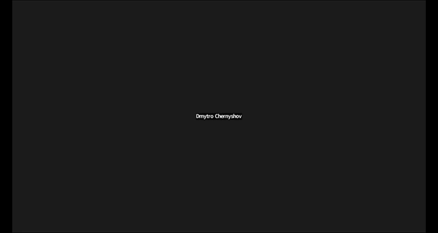

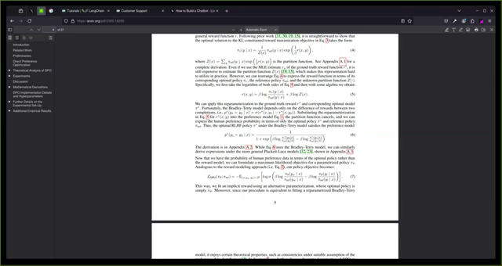

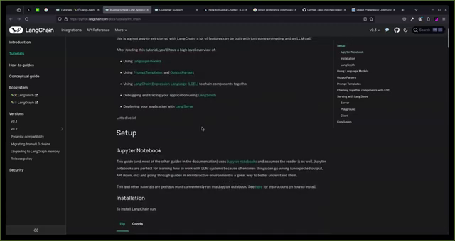

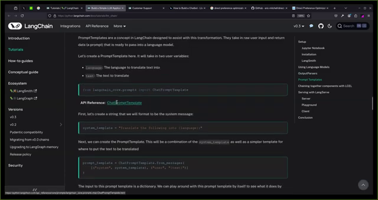

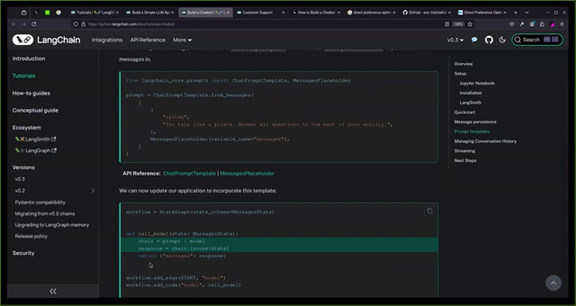

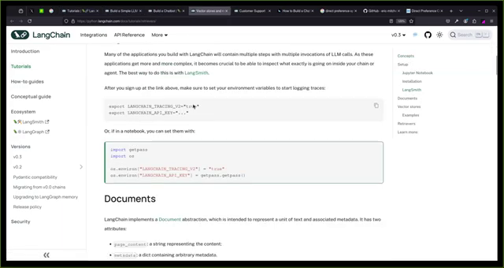

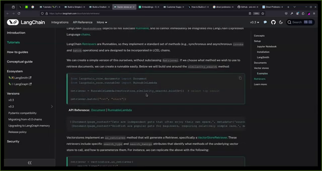

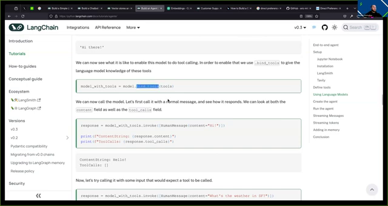

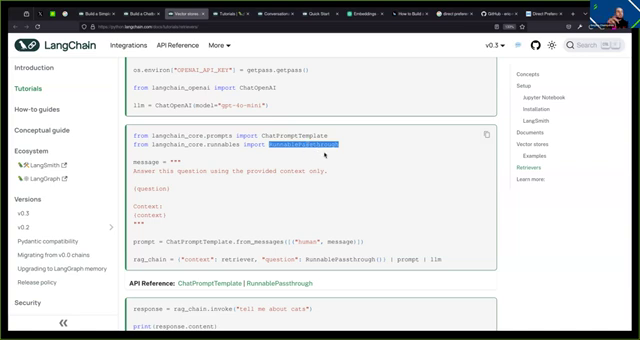

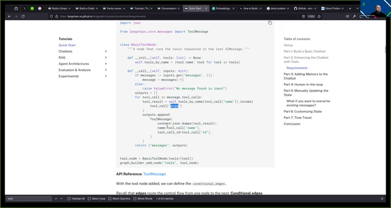

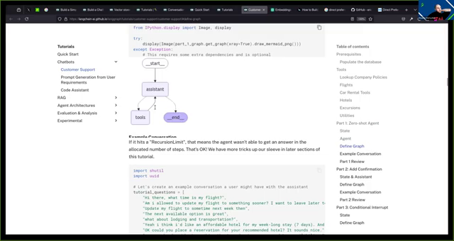

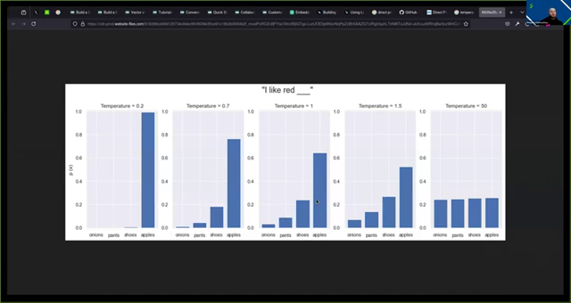

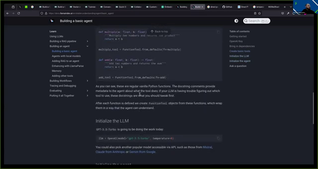

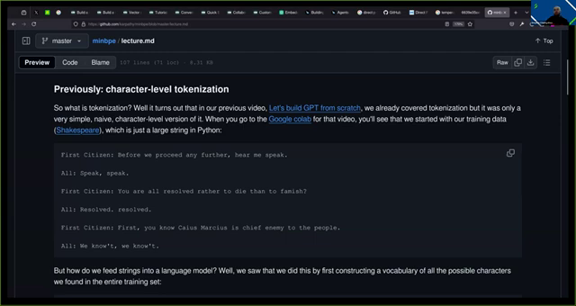

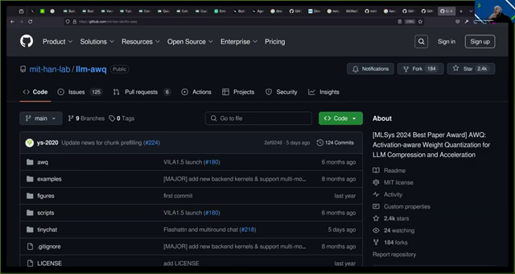

